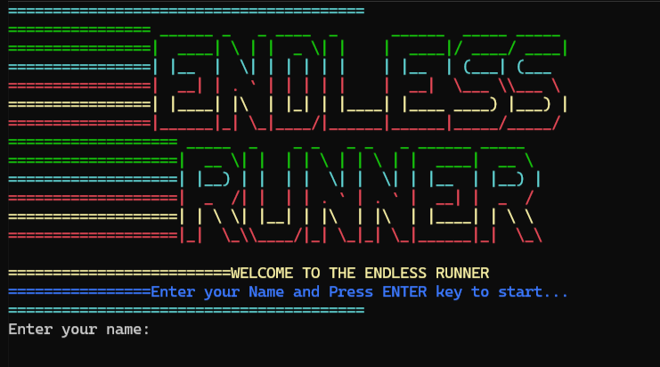
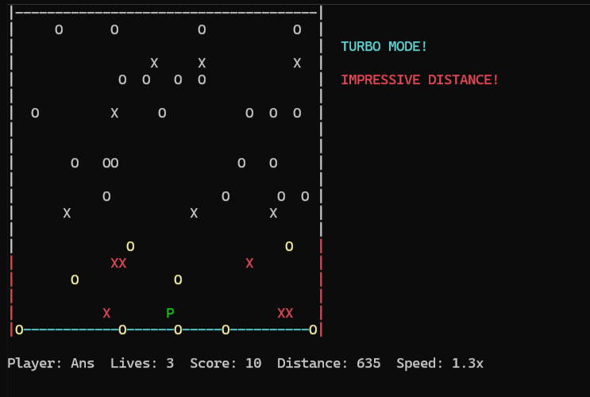

# 🏃‍♂️ ENDLESS RUNNER
### *The Ultimate Terminal-Based Adventure Game*

<div align="center">


**🎮 A thrilling console-based endless runner with dynamic obstacles, power-ups, and epic soundtracks! 🎮**

[🚀 Quick Start](#-quick-start) • [🎯 Features](#-features) • [🎮 How to Play](#-how-to-play) • [🏆 Screenshots](#-screenshots) • [⚙️ Installation](#️-installation)

</div>

---

## 🌟 Game Overview

> **Experience the adrenaline rush of an endless runner right in your terminal!**

Navigate through an ever-changing landscape filled with obstacles, collect coins, and challenge yourself to reach new distances. With dynamic speed increases, a challenging AI opponent, and an immersive soundtrack, this isn't just another console game—it's an adventure!

## 🎯 Key Features

<table>
<tr>
<td width="50%">

### 🏃‍♂️ **Core Gameplay**
- **Smooth movement** with WASD controls
- **Dynamic jumping mechanics** with realistic physics
- **Progressive difficulty** - speed increases with distance
- **Lives system** with collision detection
- **Real-time scoring** and distance tracking

</td>
<td width="50%">

### 🎵 **Immersive Experience**
- **Background music** (MP3/WAV support)
- **Sound effects** for interactions
- **Colorful terminal graphics**
- **Real-time message system**
- **High score leaderboard**

</td>
</tr>
<tr>
<td width="50%">

### 🎮 **Advanced Features**
- **AI Computer Player** (activates at 1000m)
- **Coin collection streaks** with multipliers
- **21 Speed milestones** for progression
- **Grace period** after collisions
- **Persistent high scores**

</td>
<td width="50%">

### 🎨 **Visual Elements**
- **ASCII Art interface**
- **Color-coded game elements**
- **Dynamic message displays**
- **Smooth 60 FPS gameplay**
- **Responsive UI design**

</td>
</tr>
</table>

## 🏆 Screenshots

### Game Start Screen

*Beautiful ASCII art welcome screen with colorful title and name input*

### Gameplay in Action

*Live gameplay showing player (P), obstacles (X), coins (O), and game stats*

The game features:
- **Colorful ASCII Art**: Eye-catching terminal graphics with vibrant colors
- **Real-time Stats**: Live display of player name, lives, score, distance, and speed
- **Dynamic Elements**: Moving obstacles, collectible coins, and responsive player character
- **Immersive Interface**: Professional-looking game boundaries and clean layout

## 🎮 How to Play

### Controls
```
🔼 W - Move Up        🔽 S - Move Down
◀️ A - Move Left      ▶️ D - Move Right
⏸️ SPACE - Jump       ❌ Q - Quit Game
```

### Game Elements
| Symbol | Element | Description |
|:------:|---------|-------------|
| `P` | **Player** | That's you! Stay alive and keep running |
| `X` | **Obstacles** | Avoid these red dangers at all costs |
| `O` | **Coins** | Collect for points and streak bonuses |
| `C` | **Computer Player** | AI opponent that appears at 1000m |
| `\|` `-` | **Boundaries** | Game area borders |

### Scoring System
- 🪙 **Coins**: 10 points each
- 🏃 **Distance**: Automatic progression
- 🔥 **Streaks**: Bonus points for consecutive coin collection
- 🎯 **Milestones**: Special bonuses at distance markers

## 🚀 Quick Start

### Prerequisites
- Windows Operating System
- C++ Compiler (Visual Studio/MinGW)
- Audio files (optional - included in MUSIC folder)

### Installation Steps

1. **Clone the Repository**
   ```bash
   git clone https://github.com/yourusername/endless-runner.git
   cd endless-runner
   ```

2. **Create Screenshots Directory** (if you want to add the images)
   ```bash
   mkdir screenshots
   # Add your screenshot files: game_start.png, gameplay.png
   ```

3. **Create Music Directory**
   ```bash
   mkdir MUSIC
   # Add your music files: music1.mp3 or music.wav
   ```

4. **Compile the Game**
   ```bash
   g++ -o endless_runner main.cpp -lwinmm
   ```

5. **Run and Enjoy!**
   ```bash
   ./endless_runner.exe
   ```

## 🏆 Game Progression

<details>
<summary><b>🎯 Distance Milestones (Click to expand)</b></summary>

| Distance | Speed Boost | Special Event |
|----------|-------------|---------------|
| 200m | +0.1x | First milestone celebration |
| 600m | +0.2x | Marathon runner status |
| 1000m | +0.3x | **🤖 Computer Player Activated!** |
| 2000m | +0.4x | Ultramarathon achievement |
| 5000m | +0.5x | Legendary distance |
| 10000m | MAX | **🏆 Ultimate Champion!** |

</details>

<details>
<summary><b>🎵 Audio Features (Click to expand)</b></summary>

The game supports multiple audio formats:
- **MP3 Files**: Primary format for background music
- **WAV Files**: Fallback format support
- **System Beeps**: Sound effects for interactions
- **Auto-detection**: Finds music files in multiple locations

</details>

## 🛠️ Technical Features

### Performance Optimizations
- **60 FPS Gameplay** with fixed frame timing
- **Buffered Rendering** for smooth graphics
- **Memory Management** for game elements
- **Efficient Collision Detection**

### Code Architecture
```cpp
// Key Components
- Player Movement System with Physics
- Dynamic Obstacle Generation
- Coin Collection with Streak System
- AI Computer Player Logic
- High Score Persistence
- Multi-format Audio Support
```

## 🎨 Visual Features

```
====================================
 ______ _   _ ____  _      ______  _____ _____  
|  ____| \ | |  _ \| |    |  ____|/ ____/ ____| 
| |__  |  \| | | | | |    | |__  | (___| (___   
|  __| | . ` | | | | |    |  __|  \___ \\___ \  
| |____| |\  | |_| | |____| |____ ____) |___) | 
|______|_| \_|____/|______|______|_____/_____/  

 _____  _    _ _   _ _   _ ______ _____  
|  __ \| |  | | \ | | \ | |  ____|  __ \ 
| |__) | |  | |  \| |  \| | |__  | |__) |
|  _  /| |  | | . ` | . ` |  __| |  _  / 
| | \ \| |__| | |\  | |\  | |____| | \ \ 
|_|  \_\____/|_| \_|_| \_|______|_|  \_\

WELCOME TO THE ENDLESS RUNNER
====================================
```

## 🤝 Contributing

We welcome contributions! Here's how you can help:

### 🐛 Bug Reports
Found a bug? Please create an issue with:
- Detailed description
- Steps to reproduce
- System information
- Expected vs actual behavior

### 💡 Feature Suggestions
Have ideas for improvements? We'd love to hear them:
- New obstacles or power-ups
- Additional game modes
- UI/UX enhancements
- Performance optimizations

### 🔧 Pull Requests
Ready to contribute code?
1. Fork the repository
2. Create a feature branch
3. Make your changes
4. Test thoroughly
5. Submit a pull request

## 📊 High Scores

The game automatically saves your best scores in `highscores.txt`. Challenge yourself and others to reach the top of the leaderboard!

```
High Scores:
------------
1. Player1: 850
2. Player2: 720
3. Player3: 690
4. Player4: 540
5. Player5: 420
```

## 🎉 Easter Eggs & Tips

<details>
<summary><b>🎯 Pro Tips (Click to reveal)</b></summary>

- **Coin Streaks**: Collect coins quickly for bonus multipliers
- **Jump Timing**: Use jumps strategically to avoid obstacles
- **Computer Player**: Appears at 1000m - be ready for the challenge!
- **Speed Management**: Higher speeds mean more points but harder gameplay
- **Grace Period**: You have brief invulnerability after taking damage

</details>

## 📈 Development Roadmap

- [ ] **Cross-platform support** (Linux/macOS)
- [ ] **Additional game modes** (Time Attack, Survival)
- [ ] **More obstacle types** and power-ups
- [ ] **Multiplayer support**
- [ ] **Level editor**
- [ ] **Achievement system**

## 👥 Credits

**Developers:** F24-0779 & F24-0599

Special thanks to all contributors and players who make this game awesome!

## 📄 License

This project is licensed under the MIT License - see the [LICENSE](LICENSE) file for details.

---

<div align="center">

**🌟 If you enjoyed this game, please give it a star! 🌟**

[Report Bug](../../issues) • [Request Feature](../../issues) • [Contribute](../../pulls)

**Made with ❤️ and lots of ☕**

</div>
